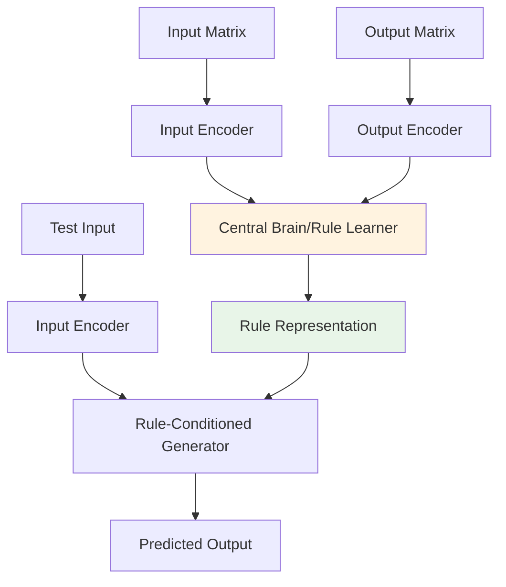

# 🧠 Dual-Encoder Architecture Project Overview

## Project Vision

We are developing a **Dual-Encoder AI System** for solving ARC (Abstraction and Reasoning Corpus) tasks. The system learns transformation rules from input-output matrix pairs and applies these rules to generate solutions for test cases.

## Core Approach

### **Dual-Encoder Concept**


## Data Format

- **Input**: Integer matrices (30x30 or variable size)
- **Values**: 0-9 representing different colors
- **Task Structure**: Multiple input-output example pairs per task
- **Goal**: Learn rules from examples, apply to test input

## Project Philosophy

### **Experimental Approach**
- **Stage-by-Stage Testing**: Build and validate components incrementally
- **Multiple Techniques**: Explore various architectures in parallel
- **Data-Driven Decisions**: Let experimental results guide design choices
- **Iterative Refinement**: Continuously improve based on findings

### **Expected Outcomes**
- **Multiple Systems**: Different architectural approaches
- **Comparative Analysis**: Thorough evaluation of each approach
- **Best System Selection**: Choose optimal combination in final phase
- **Incremental Progress**: Sequential improvement through testing stages

## Repository Structure

```
Dual_Encoder_Experiments/
├── 01_Project_Overview.md              (This file)
├── 02_Experimental_Roadmap.md          (Detailed test stages)
├── 03_Matrix_Encoding_Experiments.md   (Stage 1 experiments)
├── 04_Dual_Encoder_Architecture.md     (Stage 2 experiments)
├── 05_Rule_Application_Methods.md      (Stage 3 experiments)
├── 06_Research_Questions_Doubts.md     (Critical questions)
├── 07_Implementation_Plan.md           (Technical roadmap)
└── 08_Results_Analysis.md              (Experimental findings)
```

## Key Innovation Points

### **1. Matrix-Native Processing**
- Direct processing of integer matrices (not images)
- Preserve spatial relationships and patterns
- Handle variable grid sizes efficiently

### **2. Implicit Rule Learning**
- No explicit symbolic rule generation
- Learn transformations in embedding space
- End-to-end differentiable approach

### **3. Few-Shot Adaptation**
- Learn from minimal examples per task
- Task-specific rule extraction
- Real-time inference capability

## Success Criteria

### **Stage-wise Milestones**
1. **Matrix Reconstruction**: Perfect reconstruction of input matrices
2. **Pattern Recognition**: Identify recurring patterns in examples
3. **Rule Extraction**: Learn meaningful transformation representations
4. **Rule Application**: Generate correct outputs for test inputs
5. **Task Solving**: Achieve competitive performance on ARC benchmark

### **Final Success Metrics**
- **Accuracy**: >50% exact match on ARC validation set
- **Efficiency**: <10 seconds per task solution
- **Generalization**: Handle unseen transformation types
- **Interpretability**: Understand learned rule representations

## Next Steps

1. **Review Experimental Roadmap**: Detailed breakdown of test stages
2. **Start Stage 1**: Matrix encoding experiments
3. **Set up Evaluation Framework**: Metrics and benchmarks
4. **Begin Implementation**: First prototype development
5. **Regular Reviews**: Weekly progress assessment

## Data Access

- **Location**: `c:\Users\barad\OneDrive\Desktop\ARC\Arc_Prize\arc-prize-2025\`
- **Training Data**: `arc-agi_training_challenges.json` + `arc-agi_training_solutions.json`
- **Evaluation Data**: `arc-agi_evaluation_challenges.json` + `arc-agi_evaluation_solutions.json`
- **Test Data**: `arc-agi_test_challenges.json`

---

*This project aims to develop a novel approach to visual reasoning that combines the pattern recognition capabilities of neural networks with the precision of rule-based systems, while maintaining the flexibility to learn from minimal examples.*