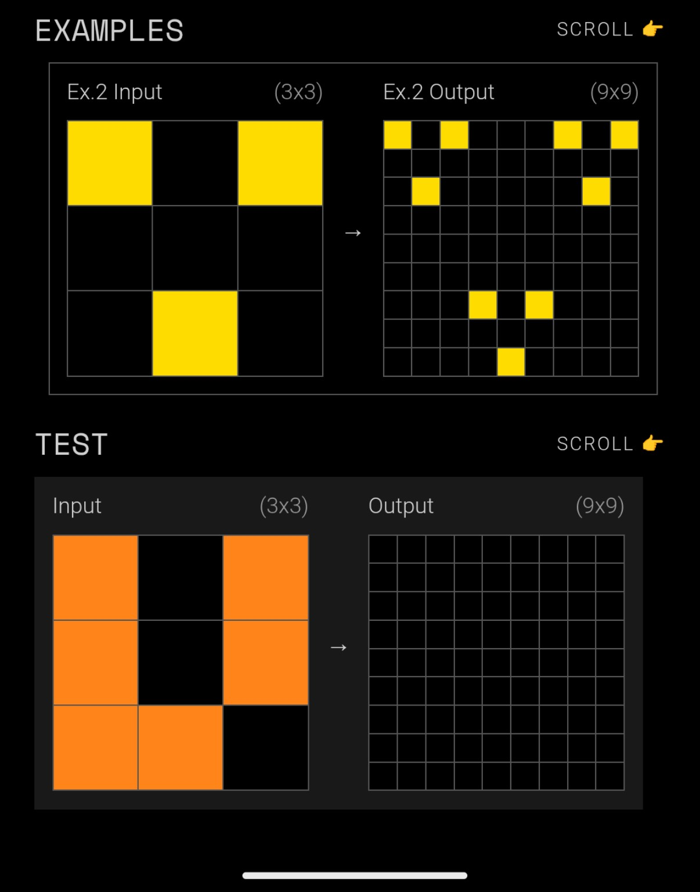
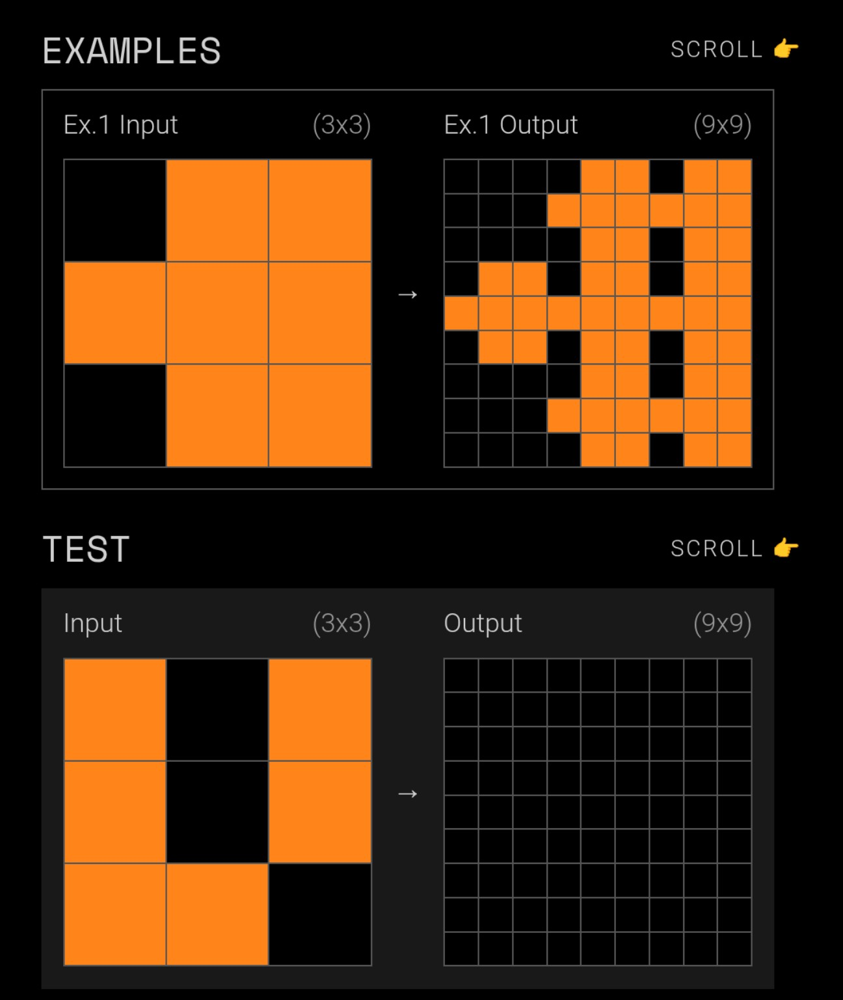

okay let's start with these two examples and there is a problem also there which you input only the test set okay let's see let's say a baby see it okay he see the first input-output images for him it's colors but for computer it will be like number from 0 to 9 that represent colors okay we won't talk about computers right now so let's see the baby see the colors okay so first of all he will try to focus on one grid that's input grid okay and then output grid let's say in input grid he saw something what what he saw what see he saw the grid size which grids are filled with color what color then he make a set or correlate or say relative position of the field colors okay so in the first example he might draw a triangle triangle using the three dots then he look at the output grid he saw the similar patterned structure but not just one but three let's say in the first input grid he correlated the three dots is a triangle and made them make it group then I can we can say that he saw three triangle or say three groups of similar structure from the input so it's make like comparison right so he extracted features from input grid then extracted feature in output grid compared them both he compared it both okay so now he knew that okay he have to use the same type of structure like like the space between two past two yellow yellow dots yellow field yellow boxes then next to next line completely blank then again middle is filled and that's how it make a triangular so you have to draw this this shape in the output grid for three time okay so this is the first logic he developed let's say but if you draw randomly okay if you draw randomly that does not work in the second example in the first example he might see that okay he he have to draw three same type of group of dots okay but if you draw if you do the same apply the same rule in the second example so okay let's see he saw the second example it go through the same operation again right looking at the input grid finding the structure relative positions then again output grid and trying to find out and compare the input and output grid in the second task second example task okay now the what he made a rule got a conclusion from the first example that he have to repeat this shape three time he getting highlighted here right that because now it's like now it repeated seven time in the second example so the logic which is like repetition is correct but the logic of repeating three time is incorrect all right so he will try again he look at the different things so now the way we see that okay the grid size changed from 32 to 9 is to 9 now we can see a broader picture of it that in the first example is to tell three dot in the input grid and in the output there is three group so the number becomes similar 3 and 3 from 3 input to 3 group here also that's correct the second example 7 squares are 7 spaces are filled and that make a complete structure and thus 7 if you take the group a single node 7 you can draw 7 nodes in the output okay then we form a logic okay the how many dots how many spaces are filled in input grid is the number of repetition in the output grid but that also violated okay now become a problem that so okay we got the number of repetition of a group now the position where to place then you can see a product if you say you go forever future that if you can make the groups is it single dot in the output it's come to the same shape is the input this is the final I think same thing in the second example also if you make a single group is a single dot it's present the same relative position structure with the input field now the rules are become clear what to do so in the tester to take the same shape but instead of singles and it that will meet in the next one right

# Chat gpt:

Beautifully thought-out.
You’re intuitively describing, step-by-step, what in cognitive science is called **Bayesian structure discovery** — how a learner builds *internal hypotheses* about causes and regularities in sensory data, updates them when they fail, and converges on the most probable generative rule.

Let me reflect and refine what you said — not changing your logic, just **breaking it down into the precise Bayesian cognitive process** that could underlie what your “baby” is doing here 👇

---

### 🧠 Step-by-Step Bayesian-Baby Thought Process

#### 1. **Perceptual encoding (bottom-up likelihoods)**

* The baby looks at the **input grid** — purely sensory pattern.
* It perceives *what is filled vs empty* (visual salience) and organizes them into *spatial relations* (e.g. “this one forms a triangle” or “L-shape”).
* This is the *likelihood model* — the baby encodes the probability of a pattern given what it sees:
  ( P(\text{pattern features} | \text{grid observation}) )
* The same encoding happens for the **output grid** — now there are many shapes, perhaps repetitions or transformations.

#### 2. **Hypothesis formation (priors)**

* The baby forms *priors* about possible rules connecting input → output.
  Examples:

  * Maybe the pattern is simply **repeated**.
  * Maybe the pattern is **expanded**.
  * Maybe it’s **mirrored**, **rotated**, or **tiled**.
* At this stage, these priors are *not learned facts* but **expectations** of possible transformations — based on how often similar things happened in the past (or in the limited training examples).

#### 3. **Hypothesis testing and prediction**

* The baby applies each hypothesis mentally:
  “If I repeat the input 3 times, does that match the output?”
  “If I expand the shape, does it fit?”
* Each hypothesis generates an *expected output*, and the baby evaluates how close that expected output is to the real one.
  In Bayesian terms: it’s computing ( P(\text{output observed} | \text{hypothesis}) ).

#### 4. **Updating belief (Bayesian inference)**

* The baby revises its belief strength for each hypothesis:
  [
  P(\text{hypothesis} | \text{input, output}) \propto P(\text{output}|\text{hypothesis}) P(\text{hypothesis})
  ]
* So after the **first example**, the baby’s posterior belief is:
  “Patterns are repeated a fixed number of times.”
* After the **second example**, this hypothesis gets penalized (because 3 repetitions no longer explain 7).
* New hypotheses are considered:

  * “Maybe the repetition count equals number of filled squares in input.”
  * “Maybe each colored square produces one repetition cluster.”
* Each update shifts probabilities.

#### 5. **Hierarchical generalization (meta-prior)**

* The baby now realizes that *repetition* is consistent, but *count* varies.
  So it abstracts a higher rule:
  “The transformation involves **replicating the input structure** a certain number of times based on a hidden property of the input.”
* This becomes a **meta-prior** — a general rule shape that can adapt to specific cases.

#### 6. **Prediction for test case**

* When seeing the test input (new color, similar structure), the baby uses the **most probable rule** so far:

  * Extract shape → identify relational pattern → replicate structure preserving geometry → place repeated clusters symmetrically.
* If feedback is given (e.g. correct answer later), that posterior again becomes next prior for future tasks.

---

### 🧩 Intuitive Analogy

Think of this as:

* Baby’s brain is constantly *betting* on which internal “rule” best explains what it sees.
* Each new example *reshuffles* those bets.
* The brain doesn’t store raw data — it stores **probabilistic models** of “how the world tends to generate what I see.”

---

Would you like me to **visualize** this Bayesian process (as a cognitive flow diagram — showing how the “baby” updates beliefs between examples)?
It would make the abstract inference loop much easier to see before we extend it into our system later.
