# 🧠 Baby-Inspired Hybrid AI Prototype Architecture

## Overview

This document presents a **hybrid neural-symbolic architecture** inspired by how babies learn through perception, memory, and experimentation. The system combines neural components for pattern recognition with symbolic primitives for grid manipulation, creating a learning system for ARC-style matrix tasks.

## Core Philosophy

### **Baby Learning Inspiration**
- **Perceptual Development**: Start with basic sensory processing, build complex understanding
- **Motor Actions**: Learn through interaction and manipulation of environment  
- **Episodic Memory**: Remember successful actions and their contexts
- **Curiosity-Driven**: Explore and experiment to understand cause-effect relationships
- **Compositional Learning**: Build complex behaviors from simple primitives

### **Technical Approach**
- **Neural-Symbolic Hybrid**: Combine continuous neural representations with discrete symbolic operations
- **Memory-Augmented**: External memory for storing and retrieving successful patterns
- **Program Synthesis**: Generate sequences of primitive operations
- **Multi-Objective Learning**: Balance prediction accuracy, memory efficiency, and exploration

---

## 🏗️ System Architecture

### **High-Level Architecture Diagram**

```mermaid
flowchart TD
    A["🟩 Input Grid
    (Matrix 0-9)"] --> B["🧠 Encoder E
    (Feature Map H×W×D)"]
    B --> C["🗂️ ProtoMemory M
    (Retrieve Nearest Prototypes)"]
    C --> D["🎛️ Controller C
    (Program Generator)"]
    D --> E["🔧 Primitives P₁…Pₙ
    (Neural/Symbolic Operations)"]
    E --> F["🧩 apply_program()
    Execute Sequence"]
    F --> G["🏁 Predicted Grid
    (Output Solution)"]
    
    %% Feedback Loops
    G --> H["📉 Loss Computation
    (L_final, L_pred, L_proto)"]
    H --> B
    H --> D  
    H --> E
    
    %% Optional Components
    B --> I["🌍 World Model W
    Predict Next State"]
    I --> H
    C --> J["💡 Curiosity Module
    Intrinsic Motivation"]
    J --> B
    
    style H fill:#ffebee
    style C fill:#e3f2fd
    style D fill:#fff3e0
```



### **Data Flow & Learning Loop**

```mermaid
sequenceDiagram
    participant Input as Input Grid
    participant Enc as Encoder (E)
    participant Mem as ProtoMemory (M)
    participant Ctrl as Controller (C)
    participant Prim as Primitives (P₁…Pₙ)
    participant Out as Output Grid
    participant Loss as Loss Engine
    
    Input->>Enc: Encode grid → (H×W×D)
    Enc->>Mem: Query nearest prototypes
    Mem->>Ctrl: Provide context + hints
    Ctrl->>Prim: Generate program sequence
    Prim->>Out: Execute transformations
    Out->>Loss: Compare to target
    Loss->>Enc: Update representations
    Loss->>Ctrl: Refine program generation
    Loss->>Prim: Adjust operations
    Loss->>Mem: Store new patterns
```



---

## 🧩 Core Components

### **1. Encoder (E) - "Visual Cortex"**

**Purpose**: Convert raw integer grids into rich feature representations

```mermaid
flowchart TD
    A["Input Grid 0-9"] --> B["One-Hot Encoding
    or Embedding"]
    B --> C["CNN Layers
    or Patch MLP"]
    C --> D["Feature Map
    H×W×D"]
    D --> E["Global Summary
    via Pooling"]
    
    style D fill:#e1f5fe
```



**Implementation Options**:
- **CNN Approach**: Small convolutional layers to detect local patterns
- **Patch-based MLP**: Treat each cell/patch as token, use MLP mixing
- **Hybrid**: CNN for local features + attention for global patterns

**Key Features**:
- Input: Integer matrices (typically 3×3 to 30×30)
- Encoding: One-hot vectors (10D for colors 0-9) or learned embeddings
- Output: Dense feature map preserving spatial structure
- Learns: Color patterns, spatial relationships, basic shapes

**Architecture Details**:
```python
class Encoder(nn.Module):
    def __init__(self, input_dim=10, hidden_dim=64, num_layers=3):
        # One-hot encoding or embedding layer
        self.embedding = nn.Embedding(10, input_dim)  
        
        # CNN layers for spatial processing
        self.conv_layers = nn.ModuleList([
            nn.Conv2d(input_dim, hidden_dim, 3, padding=1),
            nn.Conv2d(hidden_dim, hidden_dim, 3, padding=1),
            nn.Conv2d(hidden_dim, hidden_dim, 3, padding=1)
        ])
        
        # Global context extraction
        self.global_pool = nn.AdaptiveAvgPool2d(1)
```

### **2. ProtoMemory (M) - "Episodic Memory"**

**Purpose**: Store and retrieve successful pattern-action associations


**Memory Structure**:
- **Keys**: Encoded pattern representations (embeddings from Encoder)
- **Values**: Successful programs/transformations that worked for similar patterns
- **Retrieval**: Cosine similarity or learned metric for nearest neighbor search
- **Storage**: Fixed-size buffer with replacement policy (e.g., least recently used)

**Key Operations**:
```python
class ProtoMemory:
    def store(self, pattern_key, successful_program):
        # Add new pattern-program association
        
    def retrieve(self, query_pattern, k=5):
        # Find k most similar stored patterns
        # Return associated programs as hints
        
    def update(self, pattern_key, program, success_score):
        # Update existing entries based on performance
```

**Memory Benefits**:
- **Few-shot Learning**: Leverage similar past experiences
- **Transfer Learning**: Apply successful strategies to new but similar problems  
- **Efficiency**: Avoid re-deriving solutions for familiar patterns
- **Meta-Learning**: Accumulate problem-solving strategies over time

### **3. Controller (C) - "Executive Brain"**

**Purpose**: Generate sequences of primitive operations to solve the task


**Architecture Options**:
- **Transformer Decoder**: Generate program tokens autoregressively
- **LSTM Controller**: Sequential program generation with hidden state
- **Graph Neural Network**: For structured program representations

**Program Representation**:
```python
# Example program format
program = [
    ("DETECT_OBJECTS", {"color": 1}),
    ("COPY", {"source_region": "detected", "target_pos": (5, 5)}),
    ("FLOOD_FILL", {"start_pos": (0, 0), "new_color": 2})
]
```

**Training Approaches**:
- **Supervised Learning**: Train on input-output pairs with known programs
- **Reinforcement Learning**: Reward successful program execution
- **Imitation Learning**: Learn from human-demonstrated solutions
- **Self-Supervised**: Generate programs, execute them, learn from results

### **4. Primitive Library (P₁…Pₙ) - "Motor Actions"**

**Purpose**: Execute basic grid manipulation operations


**Primitive Categories**:

#### **Spatial Primitives**
```python
def COPY(grid, region, target_pos):
    """Copy region to target position"""
    
def TRANSLATE(grid, pattern, dx, dy):  
    """Move pattern by (dx, dy)"""
    
def ROTATE(grid, region, angle):
    """Rotate region by angle (90, 180, 270 degrees)"""
    
def MIRROR(grid, region, axis):
    """Mirror region across axis"""
    
def SCALE(grid, region, factor):
    """Scale region by factor"""
```

#### **Color/Value Primitives**
```python
def REPLACE(grid, old_color, new_color):
    """Replace all instances of old_color with new_color"""
    
def FLOOD_FILL(grid, start_pos, new_color):
    """Fill connected region starting from start_pos"""
    
def GRADIENT_FILL(grid, region, start_color, end_color):
    """Create color gradient in region"""
```

#### **Object-Level Primitives**
```python
def DETECT_OBJECTS(grid, color):
    """Find connected components of given color"""
    
def GET_LARGEST_OBJECT(grid, color):
    """Return largest connected component"""
    
def MERGE_OBJECTS(grid, obj1, obj2):
    """Combine two objects"""
    
def DELETE_OBJECT(grid, obj):
    """Remove object from grid"""
```

#### **Pattern Primitives**
```python
def FIND_SYMMETRY(grid, region):
    """Detect symmetry axes in region"""
    
def COMPLETE_PATTERN(grid, partial_pattern):
    """Complete partial recurring pattern"""
    
def TILE_PATTERN(grid, pattern, region):
    """Tile pattern across region"""
```

**Implementation Approaches**:
- **Symbolic**: Exact algorithmic implementations
- **Neural**: Differentiable implementations using soft attention
- **Hybrid**: Symbolic logic with neural parameter prediction

### **5. World Model (W) - "Predictive System"**

**Purpose**: Learn forward dynamics and enable planning


**Functionality**:
- **Forward Prediction**: `(grid, action) → next_grid`
- **Uncertainty Estimation**: Confidence in predictions
- **Planning Support**: Multi-step lookahead
- **Curiosity Drive**: Predict surprise/novelty for exploration

**Training Objective**:
```python
def world_model_loss(predicted_grid, actual_grid):
    return F.mse_loss(predicted_grid, actual_grid)
```

### **6. Loss Computation Engine**

**Purpose**: Multi-objective training combining several loss terms


**Loss Components**:

#### **Final Prediction Loss (L_final)**
```python
L_final = CrossEntropy(predicted_grid, target_grid)
# Per-cell classification loss for colors 0-9
```

#### **World Model Loss (L_pred)**  
```python
L_pred = MSE(world_model.predict(grid, action), actual_next_grid)
# Prediction accuracy for forward model
```

#### **Prototype Loss (L_proto)**
```python  
L_proto = ContrastiveLoss(pattern_embeddings, similar_pairs, dissimilar_pairs)
# Encourage good representations in memory
```

#### **Regularization Loss (L_reg)**
```python
L_reg = L1_penalty(program_length) + L2_penalty(model_weights)
# Encourage simple, generalizable solutions
```

#### **Total Loss**
```python
L_total = L_final + λ₁*L_pred + λ₂*L_proto + λ₃*L_reg
```

---

## 🧮 Training Strategy

### **Training Loop Pseudocode**

```python
def training_loop(dataset, num_epochs):
    for epoch in range(num_epochs):
        for task_batch in dataset:
            # Forward pass
            encoded_features = encoder(task_batch.input_grids)
            memory_hints = proto_memory.retrieve(encoded_features)
            programs = controller(encoded_features, memory_hints)
            predictions = execute_programs(programs, primitives)
            
            # Loss computation
            L_final = cross_entropy(predictions, task_batch.targets)
            L_pred = world_model_loss(...)
            L_proto = contrastive_loss(...)
            total_loss = L_final + λ₁*L_pred + λ₂*L_proto
            
            # Backward pass
            total_loss.backward()
            optimizer.step()
            
            # Memory updates
            proto_memory.store(encoded_features, successful_programs)
```

### **Three-Phase Training Strategy**

#### **Phase A: Perception (Weeks 1-4)**
**Goal**: Stable low-level representations

- **Components**: Focus on Encoder + Primitives
- **Loss**: Reconstruction + contrastive learning
- **Data**: Simple transformation tasks
- **Metrics**: Feature quality, primitive accuracy

#### **Phase B: Composition (Weeks 5-8)**  
**Goal**: Learn to combine primitives into solutions

- **Components**: Add Controller training
- **Loss**: Program imitation + execution reward
- **Data**: Multi-step transformation tasks  
- **Metrics**: Program success rate, solution accuracy

#### **Phase C: Meta-Learning (Weeks 9-12)**
**Goal**: Few-shot adaptation to novel tasks

- **Components**: Full system with ProtoMemory
- **Loss**: All loss terms, meta-learning objectives
- **Data**: Diverse task distribution
- **Metrics**: Few-shot generalization, memory efficiency

---

## 🧪 Experimental Framework

### **Evaluation Metrics**

| Metric | Description | Target | 
|--------|-------------|--------|
| **Grid Accuracy** | % of completely correct output grids | >60% |
| **Per-cell Accuracy** | % of correctly filled cells | >80% |
| **Program Length** | Average number of primitives used | <10 operations |
| **Generalization** | Accuracy on unseen grid types/sizes | >50% |
| **Sample Efficiency** | Performance vs training examples | Few-shot capable |
| **Memory Utilization** | Effective use of stored patterns | Positive transfer |

### **Ablation Studies**

#### **E1: Architecture Variants**
- **Baseline**: End-to-end U-Net (grid-to-grid supervised)
- **+Memory**: Add ProtoMemory component  
- **+Primitives**: Replace learned operations with symbolic primitives
- **+World Model**: Add predictive component for curiosity-driven learning
- **Full System**: All components integrated

#### **E2: Training Strategies**
- **Supervised Only**: Train on input-output pairs
- **+Self-Supervised**: Add world model prediction tasks
- **+Meta-Learning**: Include few-shot adaptation objectives
- **+Curriculum**: Progressive difficulty training

#### **E3: Primitive Library Design**
- **Minimal**: Basic copy, fill, replace operations
- **Standard**: Spatial transformations + color operations  
- **Extended**: Object-level and pattern-level operations
- **Learned**: Neural implementations of all primitives

#### **E4: Memory Architecture**
- **No Memory**: Fresh learning for each task
- **Simple Buffer**: Fixed-size storage with replacement
- **Hierarchical**: Multi-level memory organization
- **Associative**: Content-addressable memory with learned similarity

### **Benchmark Tasks**

#### **Simple Tasks (Baseline)**
- Single color replacement
- Basic geometric transformations (rotate, mirror)
- Simple pattern repetition

#### **Intermediate Tasks** 
- Multi-object interactions
- Conditional transformations
- Spatial relationship preservation

#### **Complex Tasks (Stretch Goals)**
- Hierarchical pattern completion  
- Abstract rule composition
- Novel pattern synthesis

---

## 🔍 Critical Analysis & Research Questions

### **Strengths of This Architecture**

#### **1. Compositionality**
- Primitives can be combined in exponentially many ways
- Enables systematic exploration of transformation space
- Mirrors human decomposition of complex tasks

#### **2. Interpretability**  
- Programs are human-readable sequences of operations
- Easy to debug and understand system reasoning
- Can visualize intermediate states during execution

#### **3. Transfer Learning**
- ProtoMemory enables knowledge sharing across tasks
- Primitives are reusable across different contexts
- World model supports planning and exploration

#### **4. Scalability**
- Modular design allows independent component improvement
- Can add new primitives without retraining entire system
- Memory system naturally handles growing experience

### **Critical Research Questions**

#### **Q1: Primitive Library Design**
**Problem**: What is the optimal set of primitive operations?

**Trade-offs**:
- **Too few primitives**: Limited expressiveness, may not cover all ARC patterns
- **Too many primitives**: Large search space, harder to learn compositions
- **Fixed vs. Learned**: Hand-coded vs. neural implementations

**Research Directions**:
- Analyze ARC dataset to identify minimal spanning set
- Study compositionality: which combinations are most useful?
- Investigate learned vs. symbolic primitive trade-offs

#### **Q2: Program Search Strategy**
**Problem**: How should the Controller explore the space of possible programs?

**Challenges**:
- Exponential growth in program length
- Need for efficient exploration vs. exploitation
- Balance between local search and global exploration

**Approaches to Investigate**:
- **Beam Search**: Maintain top-K candidate programs
- **Monte Carlo Tree Search**: Systematic exploration with value estimates
- **Reinforcement Learning**: Policy gradient methods for program generation
- **Grammar-Guided**: Use formal grammar to constrain search space

#### **Q3: Memory Organization**
**Problem**: How should ProtoMemory be structured for maximum effectiveness?

**Design Choices**:
- **Flat vs. Hierarchical**: Single-level vs. multi-level organization
- **Episodic vs. Semantic**: Store specific instances vs. abstracted patterns  
- **Static vs. Dynamic**: Fixed capacity vs. growing memory
- **Local vs. Global**: Task-specific vs. cross-task memory

**Research Questions**:
- What similarity metrics work best for pattern retrieval?
- How should memory interference be managed?
- Can we learn optimal memory organization strategies?

#### **Q4: Neural-Symbolic Integration**
**Problem**: How to effectively combine neural and symbolic components?

**Integration Challenges**:
- **Differentiability**: Making symbolic operations end-to-end trainable
- **Representation Gap**: Bridging continuous and discrete representations
- **Error Propagation**: How errors flow through hybrid components

**Potential Solutions**:
- **Soft Attention**: Use neural attention over symbolic operations
- **Gumbel-Softmax**: Differentiable discrete sampling
- **Straight-Through Estimators**: Approximate gradients through discrete ops

#### **Q5: Sample Efficiency**
**Problem**: Can this system learn efficiently from few examples per task?

**Efficiency Factors**:
- **Inductive Biases**: Built-in assumptions about grid transformations
- **Transfer Learning**: Leveraging experience from previous tasks  
- **Meta-Learning**: Learning to learn quickly from few examples
- **Curriculum Learning**: Optimal ordering of training tasks

**Evaluation Approaches**:
- Compare learning curves for different architectures
- Measure zero-shot and few-shot generalization
- Analyze which components contribute most to efficiency

### **Potential Failure Modes**

#### **1. Primitive Insufficiency**
**Risk**: The fixed primitive library cannot express required transformations

**Mitigation Strategies**:
- Extensive analysis of ARC transformation types
- Hierarchical primitives (compose low-level into high-level)
- Learned primitive acquisition during training

#### **2. Search Space Explosion**
**Risk**: Too many possible programs to search effectively  

**Mitigation Strategies**:
- Smart pruning based on partial execution results
- Learned heuristics for program ranking
- Hierarchical program synthesis (coarse-to-fine)

#### **3. Memory Interference**
**Risk**: Negative transfer from dissimilar stored patterns

**Mitigation Strategies**:
- Better similarity metrics for memory retrieval
- Context-dependent memory access
- Forgetting mechanisms for outdated patterns

#### **4. Neural-Symbolic Mismatch**
**Risk**: Poor integration between neural and symbolic components

**Mitigation Strategies**:
- Extensive ablation studies on integration methods
- End-to-end training with careful gradient flow analysis
- Hybrid architectures with smooth neural-symbolic boundaries

---

## 🚀 Implementation Roadmap

### **Phase 1: Core Infrastructure (Month 1)**
**Deliverables**:
- [ ] Basic Encoder implementation (CNN + MLP variants)
- [ ] Primitive library with 10-15 core operations
- [ ] Simple Controller (LSTM-based program generation)
- [ ] Execution engine for program sequences
- [ ] Basic training loop with supervised learning

**Milestones**:
- Successfully train on simple single-step transformations
- Achieve >80% accuracy on color replacement tasks
- Demonstrate program generation and execution pipeline

### **Phase 2: Memory & Composition (Month 2)** 
**Deliverables**:
- [ ] ProtoMemory implementation with retrieval system
- [ ] Enhanced Controller with memory conditioning
- [ ] Multi-step program composition capabilities
- [ ] World Model for forward prediction
- [ ] Contrastive learning for memory representations

**Milestones**:
- Show positive transfer from memory in few-shot scenarios
- Successfully solve multi-step transformation tasks
- Demonstrate composition of 2-3 primitive operations

### **Phase 3: Advanced Learning (Month 3)**
**Deliverables**:
- [ ] Meta-learning objectives and training procedures
- [ ] Curiosity-driven exploration mechanisms  
- [ ] Advanced primitive operations (object-level, pattern-level)
- [ ] Hierarchical memory organization
- [ ] Comprehensive evaluation framework

**Milestones**:
- Achieve competitive performance on ARC validation set
- Demonstrate learning acceleration across tasks  
- Show interpretable program generation for complex tasks

### **Phase 4: Optimization & Analysis (Month 4)**
**Deliverables**:
- [ ] Performance optimization and scaling improvements
- [ ] Comprehensive ablation studies
- [ ] Analysis of learned representations and programs
- [ ] Comparison with existing ARC solvers
- [ ] Documentation and code release

**Milestones**:
- Achieve target performance metrics
- Complete analysis of system capabilities and limitations
- Prepare research paper and open-source release

---

## 💡 Innovation Opportunities

### **Novel Contributions This Architecture Enables**

#### **1. Interpretable Program Synthesis**
- Generate human-readable explanations for transformations
- Enable debugging and verification of AI reasoning
- Support interactive human-AI collaboration

#### **2. Compositional Generalization**
- Systematically combine simple operations into complex behaviors
- Test fundamental limits of compositional reasoning
- Develop new benchmarks for compositional AI

#### **3. Memory-Augmented Few-Shot Learning**
- Novel memory architectures for visual reasoning
- Study of positive vs. negative transfer in pattern recognition
- Meta-learning approaches for rapid adaptation

#### **4. Neural-Symbolic Integration**
- New methods for combining continuous and discrete representations
- End-to-end training of hybrid architectures
- Analysis of complementary strengths of neural vs. symbolic methods

### **Broader Impact Potential**

#### **Scientific Contributions**
- Advance understanding of visual reasoning and pattern recognition
- Provide new insights into human-like AI reasoning
- Enable more interpretable and trustworthy AI systems

#### **Practical Applications**
- Automated pattern analysis in scientific data
- Interactive tools for visual programming and design
- Educational systems for teaching logical reasoning

#### **AI Safety Implications**
- More interpretable AI reasoning processes
- Ability to verify and validate AI decision-making
- Reduced black-box opacity in critical applications

---

*This architecture represents a novel approach to visual reasoning that combines the pattern recognition capabilities of neural networks with the interpretability and compositionality of symbolic systems, while incorporating human-inspired learning mechanisms like episodic memory and curiosity-driven exploration.*