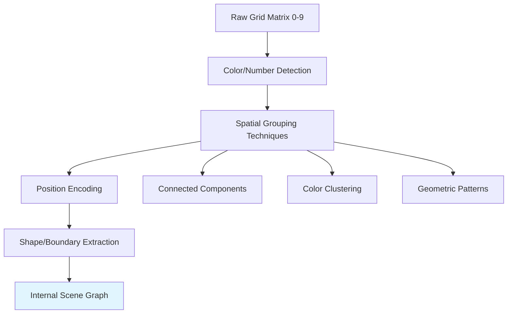
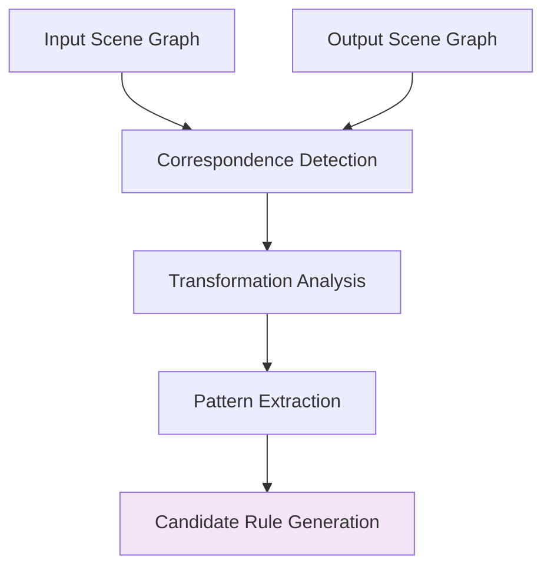
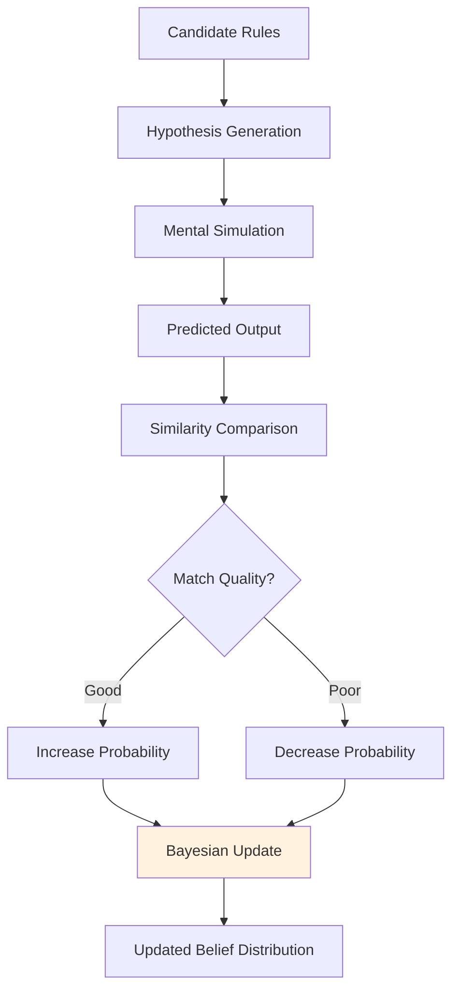
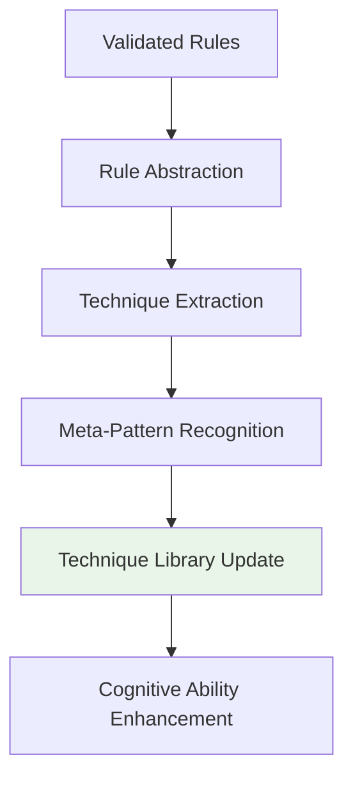
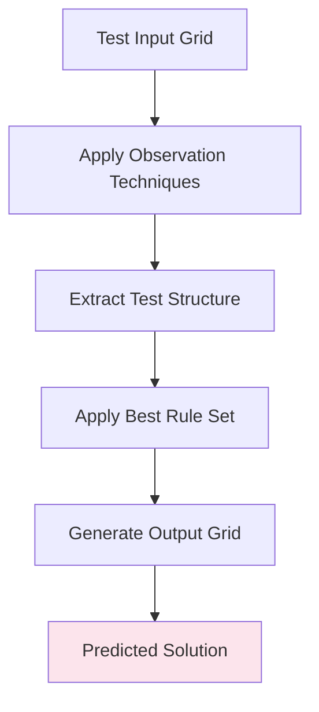
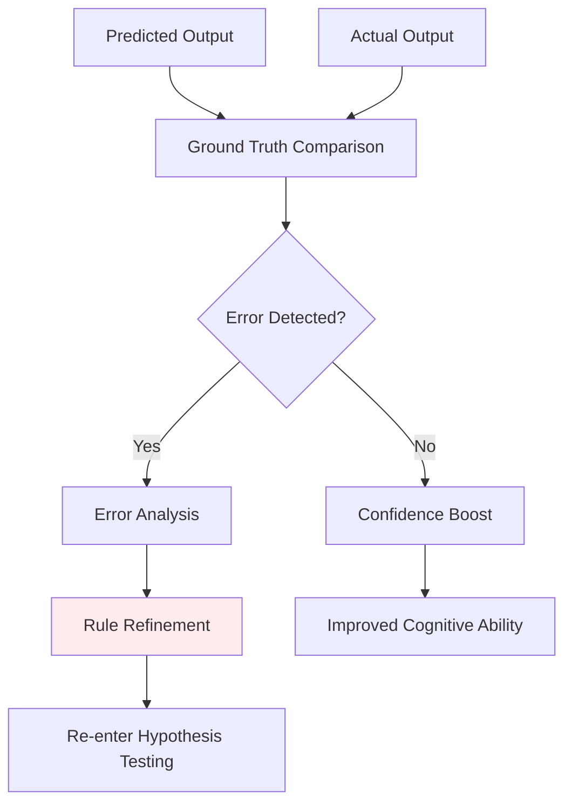
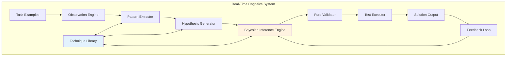
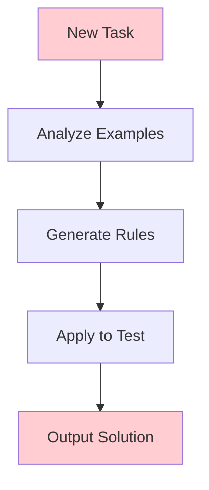
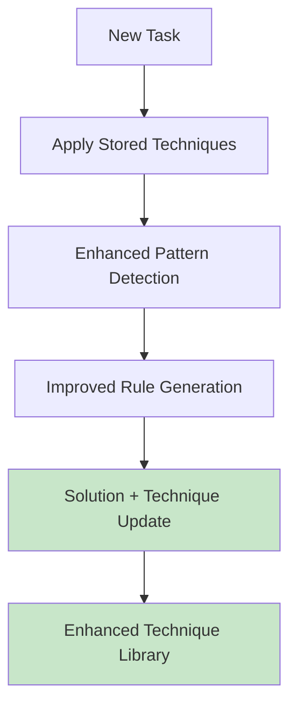
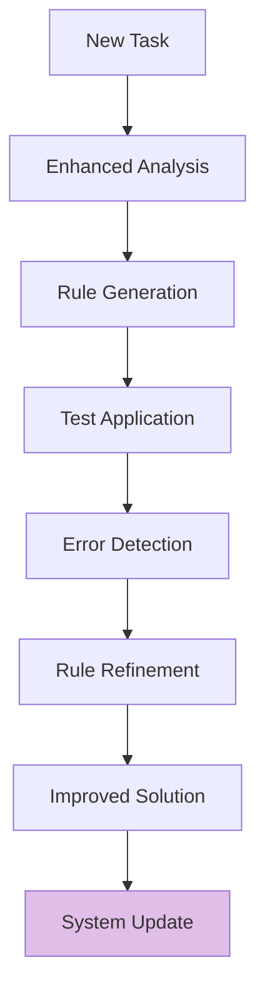

# 🧠 Real-Time Cognitive Reasoning System for ARC Tasks

## Overview

This document presents a **Bayesian-inspired cognitive reasoning system** that mimics human problem-solving for ARC (Abstraction and Reasoning Corpus) matrix tasks. Unlike traditional neural networks that memorize patterns, this system performs real-time reasoning by extracting rules from examples and applying them to novel test cases.

## Core Philosophy

### **Key Principles**
- **Task Isolation**: Each ARC task has unique transformation rules - no cross-task rule transfer
- **Real-time Learning**: System analyzes examples on-demand, not through pre-training
- **Technique Accumulation**: Stores general pattern detection methods, not specific rules
- **Bayesian Inference**: Updates transformation hypotheses based on evidence from examples
- **Human-like Reasoning**: Mimics how humans approach novel visual reasoning problems

### **Data Constraints**
- Input: Matrices of integers (0-9) representing colors
- Task Structure: Multiple input-output example pairs per task
- Goal: Extract transformation rules and apply to unseen test input
- No pixel data or external knowledge sources

---

## 🔄 Six-Stage Cognitive Process

### **Stage 1: Observation (Perception Layer)**

**Goal**: Extract structured representations from raw input/output grids



**Operations**:
- **Grouping**: Detect clusters of similar numbers (colors)
- **Position Encoding**: Record relative positions and spatial relationships
- **Shape Detection**: Identify boundaries, symmetries, geometric patterns
- **Scene Graph**: Convert grid to symbolic representation of objects and relationships

**Output**: Structured internal representation: "Object A at (x1,y1), Object B adjacent to A vertically"

### **Stage 2: Comparison and Analysis (Relational Inference Layer)**

**Goal**: Discover relationships between input and output grid structures



**Operations**:
- Compare structural representations between input/output pairs
- Identify which objects/groups correspond across transformation
- Detect transformation types (move, copy, rotate, scale, recolor, etc.)
- Extract recurring patterns across multiple examples

**Output**: Set of potential transformation rules

### **Stage 3: Hypothesis Generation and Testing (Bayesian Inference Layer)**

**Goal**: Find the most probable rule set connecting input → output



**Bayesian Formula**:
```
P(hypothesis | examples) ∝ P(output | hypothesis) × P(hypothesis)
```

**Operations**:
- Generate transformation hypotheses from detected patterns
- Simulate applying each hypothesis to input grids
- Compare predicted outputs with actual outputs
- Update hypothesis probabilities based on match quality
- Converge on highest-probability rule set

### **Stage 4: Goal Formation and Rule Consolidation (Cognitive Integration Layer)**

**Goal**: Extract reusable transformation schema and update technique library



**Operations**:
- Abstract successful rules into general techniques
- Identify reusable pattern detection methods
- Store meta-cognitive strategies (how to form rules)
- Update library of cognitive tools for future tasks

**Example Techniques Stored**:
- Grouping algorithms
- Symmetry detection methods
- Pattern replication strategies
- Spatial relationship analysis

### **Stage 5: Test Case Application (Execution Layer)**

**Goal**: Apply learned rules to generate solution for test input



**Operations**:
- Apply same observation techniques to test input
- Execute highest-probability transformation rules
- Generate predicted output matrix
- Format solution for evaluation

### **Stage 6: Feedback Loop (Error Correction Layer)**

**Goal**: Refine rules based on prediction accuracy



**Operations**:
- Compare prediction with ground truth (when available)
- Identify specific error types and locations
- Feed error information back to hypothesis generation
- Refine transformation rules and techniques

---

## 🏗️ System Architecture

### **High-Level Architecture Diagram**



### **Component Details**

#### **Observation Engine**
- **Purpose**: Convert raw grids to structured representations
- **Techniques**: Connected components, clustering, shape detection
- **Output**: Scene graphs with objects and relationships

#### **Pattern Extractor** 
- **Purpose**: Identify recurring motifs across examples
- **Methods**: Template matching, invariance detection, statistical analysis
- **Output**: Candidate transformation patterns

#### **Hypothesis Generator**
- **Purpose**: Create testable transformation rules from patterns  
- **Approach**: Combinatorial rule generation, template instantiation
- **Output**: Set of parameterized transformation hypotheses

#### **Bayesian Inference Engine**
- **Purpose**: Update rule probabilities based on evidence
- **Algorithm**: Bayesian updating with likelihood computation
- **Output**: Probability distribution over hypotheses

#### **Rule Validator**
- **Purpose**: Test hypotheses against all examples
- **Method**: Simulation and comparison
- **Output**: Validated rule set with confidence scores

#### **Technique Library**
- **Content**: Reusable pattern detection algorithms
- **Structure**: Hierarchical storage of meta-cognitive strategies
- **Evolution**: Updated after each task completion

---

## 🎯 Three System Versions

### **Version 1: Fresh Learner**


**Characteristics**:
- ✅ Simple, isolated reasoning per task
- ✅ No interference between tasks
- ❌ Inefficient - starts from scratch every time
- ❌ No accumulation of problem-solving knowledge

**Use Case**: Baseline system for comparison

### **Version 2: Cognitive Learner** ⭐ **RECOMMENDED**


**Characteristics**:
- ✅ Accumulates meta-cognitive abilities
- ✅ More human-like learning progression
- ✅ Efficiency improves over time
- ✅ Balanced complexity
- ❌ Requires meta-memory architecture

**Use Case**: Primary implementation target

### **Version 3: Full Feedback System**


**Characteristics**:
- ✅ Self-correcting and adaptive
- ✅ Handles ambiguous cases better
- ✅ Continuous improvement mechanism
- ❌ Most complex to implement
- ❌ Requires sophisticated error analysis

**Use Case**: Advanced research prototype

---

## 🔍 Critical Implementation Questions

### **1. Hypothesis Generation Challenge**

**Problem**: How to generate meaningful transformation hypotheses from limited examples?

**Approaches**:
- **Template-based**: Predefined transformation templates (rotate, copy, fill, etc.)
- **Compositional**: Combine primitive operations into complex transformations
- **Grammar-based**: Formal grammar for transformation programs
- **Neural**: Learned hypothesis generation from meta-training

**Research Direction**: Investigate hybrid template + compositional approach

### **2. Technique Library Structure**

**Problem**: What format should the reusable techniques take?

**Options**:
- **Algorithmic**: Stored procedures for pattern detection
- **Attentional**: Learned attention patterns for grid analysis  
- **Parametric**: Configurable analysis modules
- **Hierarchical**: Multi-level abstraction of techniques

**Research Direction**: Start with algorithmic, evolve toward parametric

### **3. Computational Tractability**

**Problem**: Hypothesis space can be exponentially large

**Solutions**:
- **Beam Search**: Maintain top-K hypotheses at each stage
- **Progressive Refinement**: Start simple, add complexity gradually
- **Pruning**: Early elimination of inconsistent hypotheses
- **Parallel Testing**: Simultaneous evaluation of multiple candidates

**Research Direction**: Implement beam search with progressive refinement

### **4. Pattern Detection Scope**

**Problem**: What types of patterns should the system detect?

**Categories**:
- **Spatial**: Symmetries, rotations, translations, scaling
- **Topological**: Connectivity, containment, adjacency
- **Color/Value**: Replacement rules, gradient patterns
- **Count-based**: Repetition, multiplication, aggregation
- **Relational**: Object interactions, conditional transformations

**Research Direction**: Start with spatial + color, expand systematically

### **5. Bayesian Prior Design**

**Problem**: How to set initial hypothesis probabilities?

**Strategies**:
- **Uniform**: Equal probability for all hypotheses
- **Complexity-based**: Prefer simpler transformations (Occam's razor)
- **Frequency-based**: Based on pattern frequency in training data
- **Meta-learned**: Learn priors from task distribution

**Research Direction**: Use complexity-based priors initially

---

## 🧪 Experimental Framework

### **Evaluation Metrics**

| Metric | Description | Target |
|--------|-------------|--------|
| **Task Accuracy** | % of correctly solved ARC tasks | >50% |
| **Rule Consistency** | % rules that work on all examples | >90% |
| **Technique Growth** | Rate of technique library expansion | Positive trend |
| **Reasoning Speed** | Time to generate solution | <10 seconds |
| **Sample Efficiency** | Performance vs. number of examples | Minimal degradation |

### **Ablation Studies**

1. **No Technique Library**: Version 1 vs Version 2 comparison
2. **Hypothesis Generation Methods**: Template vs compositional vs neural
3. **Pattern Detection Depth**: Shallow vs deep structural analysis
4. **Bayesian vs Frequency-based**: Different inference approaches
5. **Feedback Loop Impact**: Version 2 vs Version 3 comparison

### **Test Scenarios**

**Simple Cases**:
- Color replacement patterns
- Basic geometric transformations
- Pattern repetition tasks

**Medium Cases**:
- Multi-object interactions
- Conditional transformations
- Spatial reasoning tasks  

**Complex Cases**:
- Hierarchical pattern detection
- Abstract rule composition
- Ambiguous transformation scenarios

---

## 🚀 Implementation Roadmap

### **Phase 1: Core Components (Weeks 1-4)**
- [ ] Observation Engine with basic grouping
- [ ] Simple hypothesis generation (template-based)
- [ ] Bayesian inference framework
- [ ] Basic technique library structure

### **Phase 2: Pattern Detection (Weeks 5-8)**
- [ ] Advanced spatial pattern detection
- [ ] Color/value transformation analysis
- [ ] Compositional hypothesis generation
- [ ] Rule validation system

### **Phase 3: Meta-Learning (Weeks 9-12)**
- [ ] Technique library expansion mechanism
- [ ] Cross-task knowledge accumulation  
- [ ] Performance optimization
- [ ] Comprehensive evaluation

### **Phase 4: Advanced Features (Weeks 13-16)**
- [ ] Feedback loop implementation
- [ ] Error correction mechanisms
- [ ] Ambiguity handling
- [ ] System refinement

---

## 🎯 Success Criteria

### **Minimum Viable System**
- Correctly solve 30% of ARC validation tasks
- Demonstrate technique accumulation across tasks
- Complete analysis within reasonable time limits
- Show improvement over fresh-learning baseline

### **Target Performance**
- Achieve 50%+ accuracy on ARC benchmark
- Exhibit human-like reasoning patterns
- Demonstrate meta-cognitive growth
- Handle ambiguous cases gracefully

### **Stretch Goals**
- Exceed 70% accuracy on validation set
- Real-time performance on standard hardware
- Interpretable reasoning traces
- Novel pattern discovery capabilities

---

## 📚 Related Work & Inspiration

### **Cognitive Science Foundations**
- Bayesian approaches to human reasoning
- Analogical problem solving research
- Pattern recognition in visual cognition
- Meta-cognitive skill development

### **AI/ML Connections**
- Program synthesis approaches
- Few-shot learning methods
- Neuro-symbolic integration
- Meta-learning algorithms

### **ARC-Specific Research**
- Existing ARC solver approaches
- Visual reasoning benchmarks
- Abstract pattern recognition
- Rule induction systems

---

*This system represents a novel approach to visual reasoning that prioritizes cognitive plausibility and real-time adaptability over traditional pattern memorization methods.*