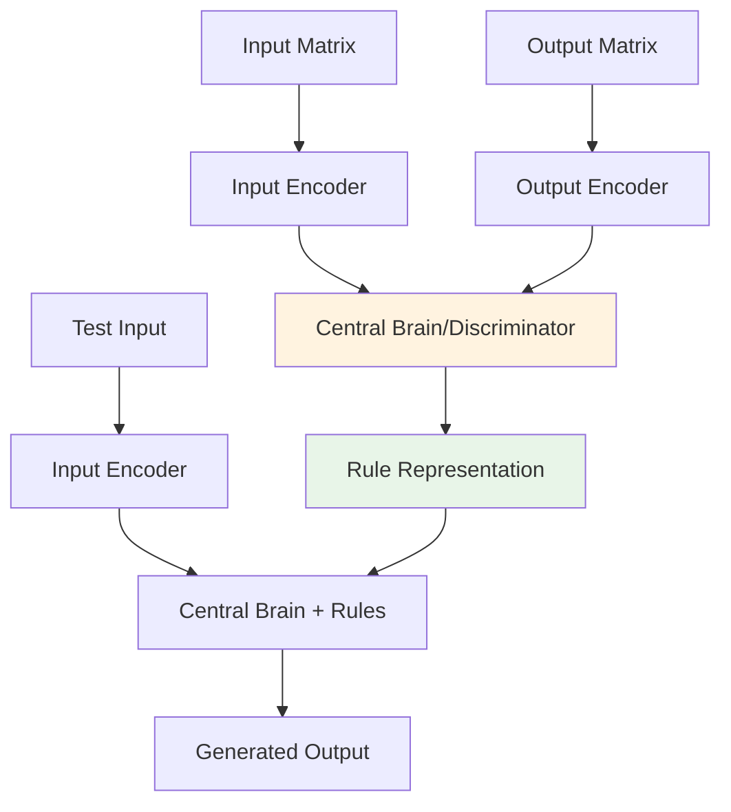
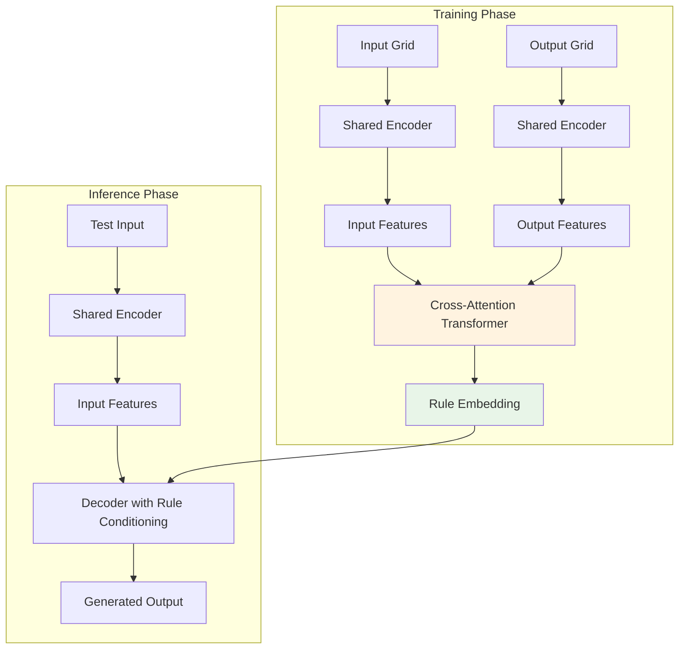

```mermaid
flowchart TD
    A[Input Matrix] --> B[Input Encoder]
    C[Output Matrix] --> D[Output Encoder]
    B --> E[Central Brain/Discriminator]
    D --> E
    E --> F[Rule Representation]
    
    G[Test Input] --> H[Input Encoder]
    H --> I[Central Brain + Rules]
    F --> I
    I --> J[Generated Output]
    
    style E fill:#fff3e0
    style F fill:#e8f5e8
```
# refined architecture proposal

```mermaid
flowchart TD
    subgraph "Training Phase"
        A[Input Grid] --> B[Shared Encoder]
        C[Output Grid] --> D[Shared Encoder]
        B --> E[Input Features]
        D --> F[Output Features]
        E --> G[Cross-Attention Transformer]
        F --> G
        G --> H[Rule Embedding]
    end
    
    subgraph "Inference Phase"
        I[Test Input] --> J[Shared Encoder]
        J --> K[Input Features]
        K --> L[Decoder with Rule Conditioning]
        H --> L
        L --> M[Generated Output]
    end
    
    style G fill:#fff3e0
    style H fill:#e8f5e8
    
```