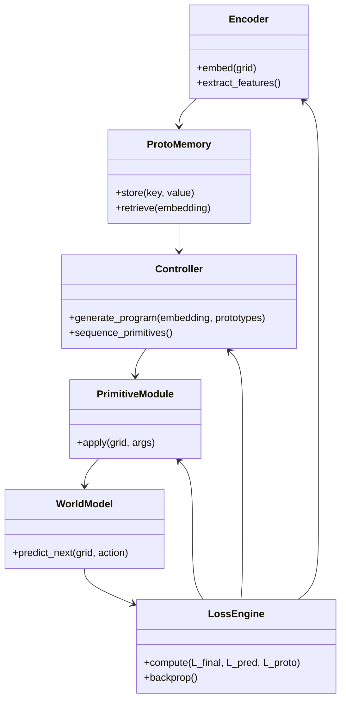
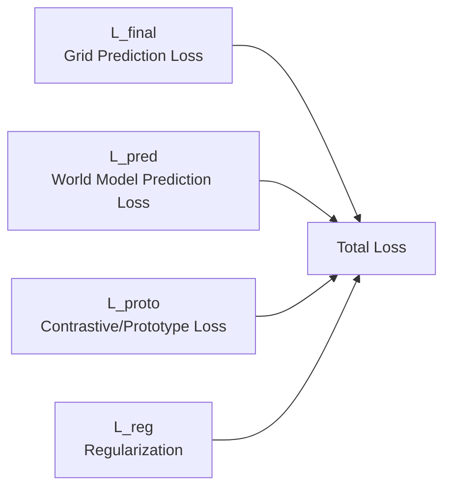
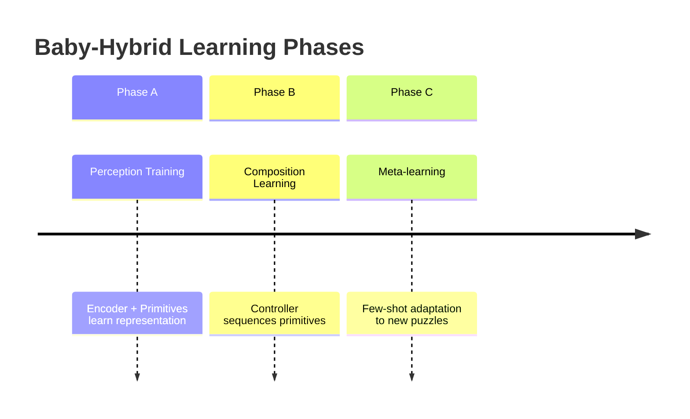

Perfect 👌

Here’s the **second Markdown file** — this one is focused *purely on visualization and structure*, making it ideal for presentation or quick review.
It distills the same architecture into **clear hierarchical Mermaid diagrams**: one for the *macro system view*, one for the *data flow and training loop*, and one for the *modular relationships*.

Save this as:
`baby_hybrid_ai_architecture_diagram.md`

---

````markdown
# 🧠 Baby-Hybrid AI Architecture — Visual Summary

This document provides a **diagram-first overview** of the Baby-inspired Hybrid AI System designed for grid-based reasoning tasks.

---

## 🩺 1. System Overview

```mermaid
graph TD
    A[🟩 Input Grid<br>(Matrix of Numbers 0–9)] --> B[🧠 Encoder E<br>(Feature Map H×W×D)]
    B --> C[🗂️ ProtoMemory M<br>(Retrieve Nearest Prototypes)]
    C --> D[🎛️ Controller C<br>(Program Generator)]
    D --> E[🔧 Primitive Modules P₁…Pₙ<br>(Neural or Symbolic Actions)]
    E --> F[🧩 apply_program()<br>Sequence of Primitives Executed]
    F --> G[🏁 Predicted Grid<br>(Output Solution)]
    G --> H[📉 Loss Computation<br>(L_final, L_pred, L_proto)]
    H --> B
    H --> D
    H --> E
    B --> I[🌍 World Model W<br>Predict Next Grid State]
    I --> H
    C --> J[💡 Curiosity & Intrinsic Motivation]
    J --> B
````

---

## 🔄 2. Data Flow & Learning Loop

```mermaid
sequenceDiagram
    participant Data as Input Grid
    participant Enc as Encoder (E)
    participant Mem as ProtoMemory (M)
    participant Ctrl as Controller (C)
    participant Prim as Primitives (P₁…Pₙ)
    participant Out as Output Grid
    participant Loss as Loss Engine

    Data->>Enc: Encode grid (H×W×D)
    Enc->>Mem: Retrieve nearest prototypes
    Mem->>Ctrl: Provide hints (past programs/patterns)
    Ctrl->>Prim: Generate primitive sequence + args
    Prim->>Out: Execute program to predict grid
    Out->>Loss: Compare output to target grid
    Loss->>Enc: Backpropagate gradients
    Loss->>Ctrl: Update program generation
    Loss->>Prim: Update primitive modules
    Loss->>Mem: Update memory with new embeddings
```

---

## 🧩 3. Internal Modular Structure



---

## 🧠 4. Core Training Objectives



[
L = L_{final} + \lambda_1 L_{pred} + \lambda_2 L_{proto} + \lambda_3 L_{reg}
]

---

## ⚙️ 5. Lifecycle Stages



---

## 📊 6. Evaluation Metrics

| Metric               | Description                          |
| -------------------- | ------------------------------------ |
| 🧩 Grid Accuracy     | % of completely correct output grids |
| 🎯 Per-cell Accuracy | % of correctly predicted cells       |
| 🔢 Program Length    | Number of primitives used            |
| 🔀 Generalization    | Performance on unseen puzzle types   |
| ⚡ Sample Efficiency  | Speed of adaptation to few examples  |

---

## 🌱 7. Key Insights

* Mimics **baby-like curiosity and compositional learning**.
* Combines **symbolic reasoning + neural perception**.
* Supports **few-shot adaptation** via memory and meta-learning.
* Scalable to more complex grid tasks (ARC-style).

---

**File:** `baby_hybrid_ai_architecture_diagram.md`
**Companion file:** `baby_hybrid_ai_architecture.md`

> Use both together:
>
> * The first file for deep technical reference.
> * This file for presentation and conceptual clarity.

---

