---
markmap:
  colorFreezeLevel: 3
  initialExpandLevel: 2
---

# 🧠 Baby-Hybrid AI Architecture for ARC

## 🎯 **Core Concept**

### Vision
- **Baby-like learning**: Start with minimal priors, learn through curiosity
- **Grid-world focus**: ARC-style 2D grids (integers 0-9 representing colors)
- **Hybrid approach**: Neural perception + Symbolic reasoning + Memory
- **Compositional intelligence**: Build complex behaviors from simple primitives

### Key Principles
- **Perception first**: Learn visual patterns before abstract rules
- **Memory-driven**: Store and reuse successful patterns/programs
- **Curiosity-driven**: Prediction errors guide attention and learning
- **Compositional**: Combine simple actions to solve complex tasks

## 🏗️ **System Architecture**

```mermaid
flowchart TD
    subgraph Input ["🔎 Input Layer"]
        A[Grid Input<br/>H×W integers 0-9]
    end
    
    subgraph Perception ["👁️ Perception Layer"]
        B[One-hot Encoder<br/>Grid → 10D vectors]
        C[Patch Embedder<br/>3×3 or 5×5 patches]
        D[Feature Map<br/>H×W×D]
    end
    
    subgraph Dual ["🧠 Dual Processing"]
        E[Neural Core<br/>Pattern Recognition]
        F[Symbolic Core<br/>Rule Extraction]
    end
    
    subgraph Memory ["🗂️ Memory System"]
        G[ProtoMemory<br/>Key-Value Store]
        H[K-NN Retrieval<br/>Similarity Search]
    end
    
    subgraph Control ["🎛️ Control System"]
        I[Controller<br/>Program Generator]
        J[Primitive Library<br/>Basic Operations]
    end
    
    subgraph Execution ["⚙️ Execution Layer"]
        K[Program Executor<br/>Apply Primitives]
        L[Output Grid<br/>Transformed Result]
    end
    
    subgraph Learning ["📊 Learning Loop"]
        M[Loss Computation<br/>Multi-objective]
        N[World Model<br/>Prediction]
        O[Curiosity Signal<br/>Surprise Detection]
    end

    A --> B --> C --> D
    D --> E
    D --> F
    E --> G
    F --> G
    G --> H --> I
    I --> J --> K --> L
    L --> M
    M --> N --> O
    O --> E
    O --> F
    M --> I
    M --> E
    M --> F
```



### 🔄 **Data Flow Sequence**

```mermaid
sequenceDiagram
    participant Input as Grid Input
    participant Enc as Encoder
    participant Neural as Neural Core
    participant Symbolic as Symbolic Core
    participant Mem as ProtoMemory
    participant Ctrl as Controller
    participant Prim as Primitives
    participant Output as Grid Output
    participant World as World Model

    Input->>Enc: Raw grid (H×W×int)
    Enc->>Neural: Feature maps
    Enc->>Symbolic: Feature maps
    Neural->>Mem: Pattern embeddings
    Symbolic->>Mem: Proto-concepts
    Mem->>Ctrl: Retrieved programs
    Ctrl->>Prim: Program sequence
    Prim->>Output: Transformed grid
    Output->>World: Prediction error
    World->>Neural: Curiosity signal
    World->>Symbolic: Update rules
```



## 🧩 **Component Details**

### 👁️ **Perception System**
- **Input Processing**
  - One-hot encoding: 0-9 → 10D vectors
  - Patch embedding: Local spatial context (3×3, 5×5)
  - Feature extraction: CNN or patch-based MLP
- **Output**: Dense feature representation H×W×D

### 🧠 **Neural Core (Bottom-up)**
- **Contrastive Learning**: Learn invariant patch representations
- **Clustering**: Discover common visual patterns
- **Segmentation**: Identify connected components
- **Self-supervision**: InfoNCE loss for representation quality

### 🔤 **Symbolic Core (Top-down)**
- **Proto-concept Extraction**: Connected regions, shapes, symmetries
- **Rule Hypothesis**: Generate candidate transformation rules
- **DSL Generation**: Express rules in domain-specific language
- **Verification**: Test rule validity against examples

### 🗂️ **Memory System**
- **Storage**: (patch_embedding, program) pairs
- **Indexing**: FAISS or K-NN for fast retrieval
- **Capacity**: Episodic memory with forgetting mechanism
- **Generalization**: Few-shot learning via similarity

### 🎛️ **Control System**
- **Program Generation**: Sequence primitives to achieve goals
- **Planning**: Use world model for lookahead
- **Adaptation**: Meta-learning for rapid task switching
- **Architecture**: Transformer or LSTM-based controller

## 🔧 **Primitive Library**

### Basic Operations
- **FLOOD_FILL(start_pos, target_color)**
  - Fill connected region with new color
  - Neural: Soft attention masks
  - Symbolic: Breadth-first search
  
- **COPY(source_region, target_pos)**
  - Copy pattern to new location
  - Handle overlaps and boundaries
  
- **REPLACE(from_color, to_color, mask)**
  - Replace all instances of color
  - Optional regional masking
  
- **TRANSLATE(pattern_mask, dx, dy)**
  - Shift pattern by offset
  - Handle wrapping/clipping
  
- **ROTATE(pattern_mask, angle)**
  - Rotate pattern (90°, 180°, 270°)
  - Around center or pivot point

- **MIRROR(pattern_mask, axis)**
  - Reflect across horizontal/vertical axis
  - Preserve or adapt to boundaries

### Advanced Operations
- **MERGE(region_a, region_b, rule)**
  - Combine regions based on rule
  - Color mixing, majority vote, etc.
  
- **EXTRACT_PATTERN(region)**
  - Identify repeating motifs
  - Create reusable templates
  
- **APPLY_TEMPLATE(template, positions)**
  - Stamp template at locations
  - Handle variations and scaling

## 📊 **Learning Framework**

### Loss Functions
```
L_total = L_final + λ₁·L_pred + λ₂·L_proto + λ₃·L_reg

L_final:  Cross-entropy per cell (predicted vs target)
L_pred:   World model prediction accuracy  
L_proto:  Contrastive loss for embeddings
L_reg:    Program complexity regularization
```

### Training Phases

#### Phase 1: Perception Learning
- **Goal**: Learn robust visual representations
- **Method**: Self-supervised contrastive learning
- **Dataset**: Random grid patterns
- **Duration**: Until convergence of patch embeddings

#### Phase 2: Primitive Mastery
- **Goal**: Master basic operations
- **Method**: Supervised learning on simple transformations
- **Dataset**: Single-operation examples (flood-fill, copy, etc.)
- **Metrics**: Operation success rate

#### Phase 3: Program Composition
- **Goal**: Learn to sequence primitives
- **Method**: Imitation learning or reinforcement learning
- **Dataset**: Multi-step transformation examples
- **Challenge**: Credit assignment across steps

#### Phase 4: Memory Integration
- **Goal**: Leverage episodic memory for few-shot learning
- **Method**: Meta-learning (MAML, Prototypical Networks)
- **Dataset**: Novel patterns with few examples
- **Evaluation**: Rapid adaptation speed

#### Phase 5: Meta-Learning
- **Goal**: Quick adaptation to new task distributions
- **Method**: Task-agnostic meta-learning
- **Dataset**: Diverse ARC-style tasks
- **Target**: Human-level sample efficiency

### Curriculum Design
- **Level 0**: Single-color grids, basic fills
- **Level 1**: Two colors, simple shapes
- **Level 2**: Multiple colors, geometric patterns  
- **Level 3**: Complex shapes, spatial relationships
- **Level 4**: Abstract rules, logical patterns
- **Level 5**: Full ARC complexity

## 🧪 **Evaluation & Experiments**

### Core Metrics
- **Grid Accuracy**: Percentage of perfectly solved grids
- **Cell Accuracy**: Per-cell prediction accuracy  
- **Program Efficiency**: Average primitives used per solution
- **Sample Efficiency**: Performance vs training examples
- **Generalization**: Performance on held-out patterns

### Ablation Studies
- **Memory On/Off**: Effect of episodic memory
- **Neural vs Symbolic**: Compare processing modes
- **World Model**: Impact on curiosity and planning
- **Curriculum**: Structured vs random training order
- **Primitive Types**: Neural vs symbolic operations

### Baseline Comparisons
- **End-to-end CNN**: Pure neural approach
- **Program Synthesis**: Pure symbolic approach  
- **Hybrid Variants**: Different neural-symbolic combinations
- **Human Performance**: Sample efficiency benchmark

## 🚀 **Implementation Roadmap**

### Quick Start (Weeks 1-2)
- **Minimal Encoder**: Simple CNN for grid embedding
- **Basic Primitives**: 3-5 core operations (symbolic)
- **Direct Controller**: Map embeddings to single primitives
- **Simple Dataset**: Single-step transformations

### Core System (Weeks 3-6)
- **Full Encoder**: Patch-based feature extraction
- **Memory System**: K-NN prototype storage/retrieval
- **Program Controller**: Sequence multiple primitives
- **Training Loop**: Multi-objective loss with backprop

### Advanced Features (Weeks 7-10)
- **World Model**: Forward prediction capability
- **Curiosity System**: Surprise-driven exploration
- **Meta-learning**: Few-shot adaptation mechanisms
- **Curriculum**: Progressive difficulty scaling

### Evaluation & Optimization (Weeks 11-12)
- **Comprehensive Testing**: Full ARC evaluation
- **Ablation Studies**: Component importance analysis
- **Performance Optimization**: Speed and memory efficiency
- **Documentation**: Complete system description

## 💡 **Research Insights**

### Why Baby-like Learning?
- **Minimal Priors**: No pre-trained language models or external knowledge
- **Curiosity-Driven**: Intrinsic motivation guides exploration
- **Compositional**: Build complexity from simple building blocks  
- **Memory-Based**: Episodic learning enables few-shot generalization
- **Predictive**: World models enable planning and imagination

### Key Innovations
- **Hybrid Architecture**: Best of neural and symbolic approaches
- **Episodic Memory**: Prototype-based few-shot learning
- **Curiosity Mechanism**: Prediction errors drive attention
- **Compositional Primitives**: Reusable building blocks
- **Meta-Learning**: Rapid adaptation to new distributions

### Expected Challenges
- **Credit Assignment**: Which primitive in sequence caused success/failure?
- **Primitive Discovery**: How to automatically discover new operations?
- **Scaling**: Performance on larger, more complex grids?
- **Generalization**: Transfer to fundamentally different patterns?
- **Sample Efficiency**: Match human learning speed?

## 🔮 **Future Directions**

### Near-term Extensions
- **Dynamic Primitives**: Learn new operations during training
- **Hierarchical Programs**: Subroutines and function composition
- **Multi-modal Input**: Handle grids with additional properties
- **Parallel Execution**: Multiple simultaneous transformations

### Long-term Vision
- **General Intelligence**: Extend beyond grid domains
- **Natural Language**: Incorporate linguistic descriptions
- **Collaborative Learning**: Multiple agents sharing knowledge
- **Continual Learning**: Lifelong skill acquisition
- **Human-AI Interaction**: Natural teaching and feedback