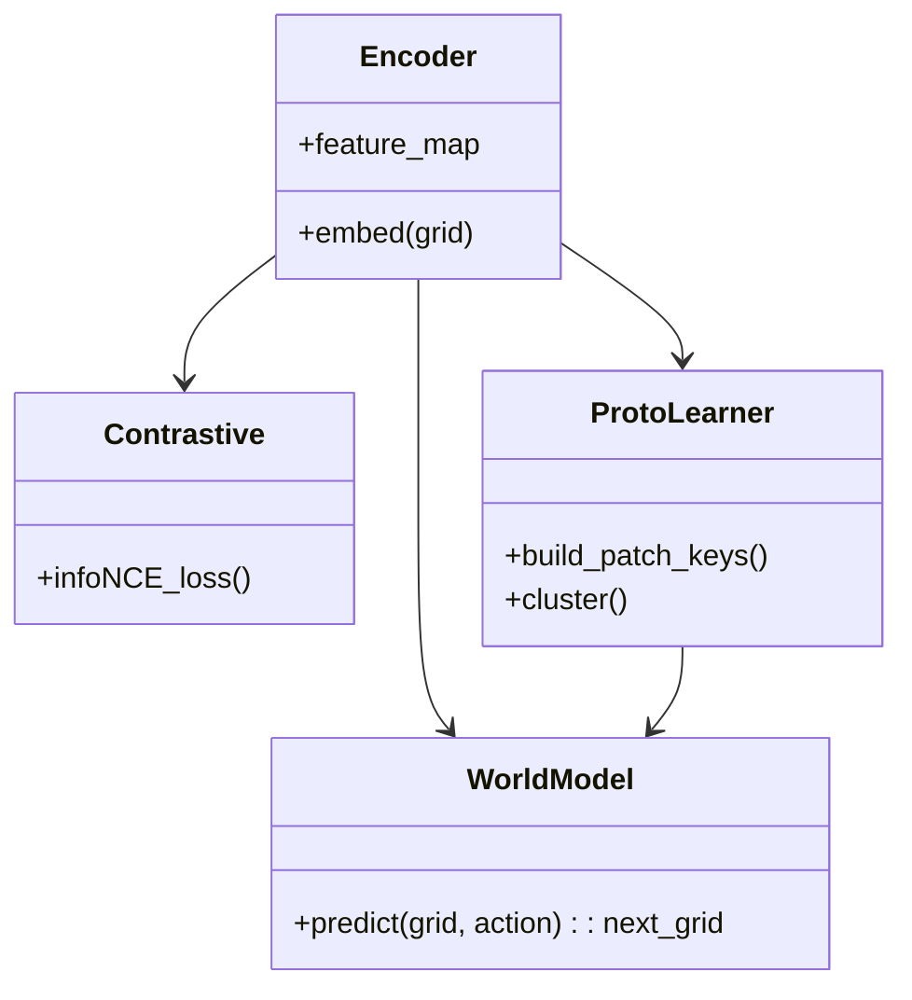

# Baby-Brain ARC Learner — `index.md`

> A single, self-contained reference (visual + textual) that captures the **baby-inspired hybrid vertical architecture** specialized for ARC-style grid tasks (grids of integers 0–9).
> Includes flow diagrams, component diagrams, sub-system details, training loop, losses, and quick links to your other notes.

---

## Overview — goal & assumptions

**Goal:** build an AI that learns like a baby for a *single-task* grid world (ARC-like).

* Input: small 2D grid of integers (0–9) representing colors.
* Output: solved grid (transform, fill, or otherwise modify the grid).
* Agent starts with **minimal priors** (no language, no external knowledge).
* Emphasis: perception → proto-concepts → primitives → composition → memory → curiosity → meta-adaptation.

Keep this file linked to your other notes:

* `[[computer_architecture]]` — (link to your computer architecture file)
* `[[other_topics]]` — (link to your other file)

---

# 1. Main System (Baby-Brain Analogy) — Flow

```mermaid
flowchart TD
  style A fill:#ffe6e6,stroke:#d9534f
  style B fill:#fff4cc,stroke:#f0ad4e
  style C fill:#e6f7ff,stroke:#5bc0de
  style D fill:#e9f7ef,stroke:#5cb85c
  style E fill:#f5e6ff,stroke:#8e44ad
  style F fill:#f0f0f0,stroke:#666

  A[🔎 Sensory Input<br/>Grid (0–9)] --> B[👁️ Perception / Encoder E<br/>(one-hot embed → CNN / Patch MLP)]
  B --> C[🧠 Neural Learning Core<br/>feature maps, contrastive learning]
  B --> D[🔤 Symbolic Reasoning Core<br/>proto extraction, DSL / primitives]
  C --> E[🗂️ ProtoMemory (episodic)<br/>store: embedding → program]
  D --> E
  C --> F[🌍 World Model W<br/>(predictive forward model)]
  F --> C
  E --> G[🎛️ Controller (C)<br/>program generator / planner]
  G --> H[🔧 Primitive Library Pᵢ<br/>(FLOOD_FILL, COPY, REPLACE, TRANSLATE...)]
  H --> I[🧩 apply_program() → Output Grid]
  I --> J[📊 Loss / Feedback<br/>(L_final, L_pred, L_proto)]
  J --> B
  J --> C
  J --> D
  J --> E

  subgraph DiscoveryLoop [💡 Curiosity / Discovery Loop]
    F -->|predict| J
    J -->|surprise| E
    J -->|curiosity signal| G
  end
```

**Short explanation:**
The input grid goes through a sensory encoder that produces feature maps. These feature maps feed a neural core (bottom-up pattern discovery) and a symbolic core (top-down proto extraction and candidate rules). A shared episodic prototype memory stores embeddings and associated programs. A controller composes primitives (neural or symbolic) to form a program which when applied produces the output. Prediction errors (surprise) drive updates across modules and produce curiosity signals that bias exploration and memory storage.

---

# 2. Sub-diagrams — Sensory Layer, Neural Core, Symbolic Core

## 2.1 Sensory Layer (Perception)

```mermaid
flowchart LR
  InputGrid[Grid (H×W; ints 0–9)]
  InputGrid --> OneHot[One-hot / Embedding]
  OneHot --> PatchEmbed[Patch embed / small Conv]
  PatchEmbed --> FeatureMap[Feature Map H×W×D]
  FeatureMap --> VisualHeads[Contrastive head / Segmentation head / Patch keys]
```

**Notes:**

* Represent each cell as a one-hot (10D) or small embedding vector.
* Patch embedding (3×3 or 5×5) helps capture local spatial contexts.
* Produce feature maps used by both Neuro and Symbolic cores.

---

## 2.2 Neural Learning Core (bottom-up)



**Responsibilities:**

* Learn invariant local features (edges, corners, common patches).
* Train with contrastive losses to produce meaningful embeddings.
* Learn a world model predicting the effect of primitives (helps curiosity).

---

## 2.3 Symbolic Reasoning Core (top-down)

```mermaid
flowchart TD
  FM[Feature Map]
  FM --> CC[Connected Components / Morphology]
  CC --> ProtoExtract[Prototype extraction (region, majority value)]
  FM --> RuleSynth[Rule hypothesis generator (small DSL)]
  ProtoExtract --> RuleSynth
  RuleSynth --> CandidatePrograms
```

**Responsibilities:**

* Create proto-concepts (connected regions, majority-value regions, symmetry patterns).
* Hypothesize simple rules (e.g., "fill enclosed hole with surrounding color", "copy shape", "mirror row").
* Represent rules in a small DSL (primitives + args) to be tested by controller.

---

# 3. Primitive Library — list & implementation notes

**Primitive examples (baby 'motor actions'):**

* `FLOOD_FILL(start_cell)` — fills contiguous region of start_cell's value (or target value).
* `COPY(region_mask, value)` — copy value into masked region.
* `REPLACE(from_value, to_value, mask?)` — replace occurrences.
* `TRANSLATE(pattern_mask, dx, dy)` — shift a pattern.
* `ROTATE(pattern_mask, angle)` — rotate local pattern (if relevant).
* `MERGE(regionA_mask, regionB_mask)` — join two regions based on a rule.

**Implementation choices:**

* Use **neural primitives** as mask-generators: primitives output soft masks (H×W with values in [0,1]) and target values; differentiable for end-to-end learning.
* Or use **symbolic primitives** implemented as deterministic grid ops for search & verification (good for program induction).

---

# 4. Memory & Retrieval

```mermaid
flowchart LR
  PatchEmb[Patch Embedding]
  PatchEmb --> MemStore[Prototype Memory (Key-Value)]
  MemStore --> Retriever[K-NN retrieval]
  Retriever --> Controller
```

**Key points:**

* Memory stores (key = patch embedding, value = exemplar program or patch target).
* Retrieval uses K-NN in embedding space.
* Memory supports few-shot generalization: if a novel patch is close to stored key, reuse stored program.

---

# 5. World Model & Curiosity

**World model:** `W(grid, action) -> predicted_next_grid`
**Curiosity signal:** magnitude of prediction error → `||pred - actual||` drives attention, memory storage, and practice.

**Use-cases:**

* Prioritize which patterns to practice (high surprise).
* Generate internal imagined rollouts for planning (simulate applying candidate programs before executing).

---

# 6. Training loop (practical pseudocode)

```python
# high-level pseudocode
for epoch in range(E):
    for grid, target in dataloader:
        z = Encoder(grid)                        # HxWxD
        prototypes = Memory.retrieve(z)          # nearest K prototypes
        program = Controller.generate(z, prototypes)  # sequence of (primitive, args)

        # apply program (differentiable or discrete)
        pred_grid = apply_program(grid, program, Primitives)

        # compute losses
        L_final = cross_entropy(pred_grid, target)        # per cell
        L_pred  = world_model_loss(...)                   # prediction quality
        L_proto = contrastive_loss(z, positives, negatives)
        loss = L_final + lambda1*L_pred + lambda2*L_proto

        # update all differentiable modules
        loss.backward()
        optimizer.step()

        # memory update (store new prototype-program pair if novel)
        Memory.maybe_store(z_patch, program)
```

**Practical note:**

* If primitives are discrete and program generation uses sampling, use REINFORCE or imitation learning when program ground-truth is not available.
* A curriculum from easy → complex tasks helps stabilize learning.

---

# 7. Losses & Objective

[
L_{total} = L_{final} + \lambda_1 L_{pred} + \lambda_2 L_{proto} + \lambda_3 L_{reg}
]

* `L_final`: cross-entropy per-cell between final predicted grid and target.
* `L_pred`: MSE (or cross-entropy) between world-model predicted next-grid and true next-grid (if training on intermediate steps).
* `L_proto`: InfoNCE / contrastive loss for patch embeddings.
* `L_reg`: regularization (L2, entropy on program distribution to avoid degenerate long programs).

---

# 8. Learning Phases (Vertical curriculum)

1. **Phase A — Perception & Representation**

   * Train Encoder & ProtoLearner (contrastive/self-supervised).
   * Learn patch embeddings and segmentation heuristics.

2. **Phase B — Primitive Mastery**

   * Teach & verify primitives (flood-fill, copy) on simple synthetic examples.

3. **Phase C — Program Composition**

   * Train Controller to sequence primitives to achieve target transformations (imitation or RL).

4. **Phase D — Memory & Few-shot**

   * Populate prototype memory during episodes; evaluate retrieval-based generalization.

5. **Phase E — Meta / Transfer**

   * Use MAML / ProtoNet-style adaptation for rapid learning from few ARC examples.

---

# 9. Evaluation (metrics & experiments)

**Metrics**

* **Grid Accuracy:** % of grids solved exactly.
* **Per-cell Accuracy:** fraction of correct cells.
* **Program Efficiency:** average number of primitives used.
* **Generalization Tests:** evaluate on new patterns, unseen color-number mappings, different grid sizes.
* **Sample Efficiency:** performance after N examples (N small).

**Experiments / Ablations**

* U-Net baseline (end-to-end supervised) vs hybrid system.
* Neural primitives vs symbolic primitives.
* Memory on/off (test few-shot).
* World-model on/off (test curiosity effect).
* Curriculum vs no curriculum.

---

# 10. Quick Implementation Checklist (practical)

* [ ] Choose framework: **PyTorch** (recommended) or JAX.
* [ ] Implement Encoder (one-hot → small conv / patch embed).
* [ ] Implement contrastive head for proto-learning.
* [ ] Implement primitives as differentiable mask modules.
* [ ] Implement small Controller (Transformer or LSTM).
* [ ] Implement Prototype Memory (FAISS or simple K-NN for small scale).
* [ ] Implement World Model for forward prediction.
* [ ] Build simple synthetic curriculum datasets (1–3 simple rules) and scale up.
* [ ] Logging & visualization for prototype retrieval & program traces.

---

# 11. Notes on Generalization (optional)

> This file is ARC-specific by design (grids, discrete symbols). The same architecture can be adapted to other modalities by:

* replacing the sensory encoder (e.g., images → CNN / audio → spectrogram encoder),
* expanding primitive set for that domain,
* maintaining the memory + controller + world-model loop.

But for now — keep it ARC-focused.

---

# 12. Links & Navigation

* Link back to other notes:

  * `[[computer_architecture]]` — your computer architecture notes
  * `[[other_topics]]` — other project notes

* Companion files (if you want to keep separated later):

  * `baby_hybrid_ai_architecture.md` — in-depth textual description (long-form)
  * `baby_hybrid_ai_architecture_diagram.md` — diagram-only / presentation version

---

# 13. Short checklist for next discussion (baby learning topics)

When you're ready to continue our baby-learning discussion, we can deep-dive into any of these:

* How to construct an unsupervised patch-embedding curriculum for low-level perception.
* Designing a compact DSL and symbolic primitives for ARC tasks.
* Program induction: beam search vs neural program synthesis.
* Memory design: what counts as a prototype, when to store, eviction strategies.
* Curiosity formulation: prediction error vs information gain.

